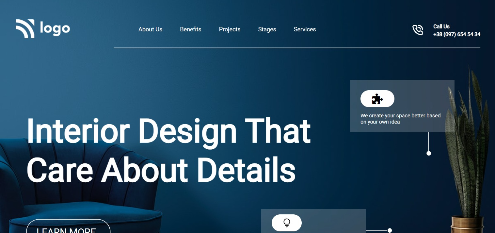

# Interior Design Landing Page

Made by **Omprasad Dornala**

## Description

This website focuses on handling various sections when placing card components and arranging elements.

## Built with

- Semantic HTML
- CSS
- Flexbox

## Key learnings

- Absolute positioning of elements.
- To apply background images.
- Create cards using flexbox
- Design footer section.

## Time taken

- This project took me more than two hours of time.

## Deployed Version Link

- [Live Demo](https://interior-design-landing-page-op.netlify.app/)

## Snapshot of Webpage

